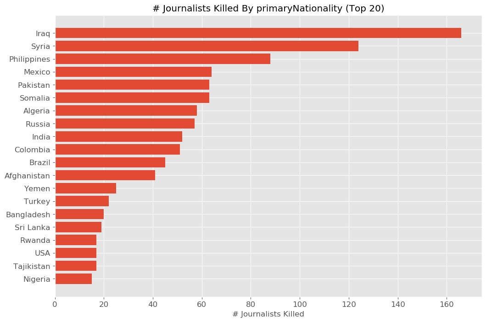

# Journalists-Under-Fire
An analysis of attacks on journalists and press freedom.

**IN PROGRESS**

# Overview

A free press is a vital component of deomcracy. 

Some of the questions I had in mind when conducting the analysis included:
- Are there any trends over time? Has being a journalist become more or less dangerous?
- Spatial trends; which countries are the most dangerous for journalists?
- What types of issues are most dangerous to cover?
- What specific jobs are the most dangerous?
- What are the most common sources of attacks on journalists?

# Data 

## Sources
The [Committee to Protect Journalists](https://cpj.org/) (CPJ) maintains a worldwide [database](https://cpj.org/data/) of press workers killed since 1992, and information/circumstances surrounding each death.

The [US Press Freedom Tracker](https://pressfreedomtracker.us/) maintains a [database](https://pressfreedomtracker.us/data/) of press freedom violations/attacks on the press in the US.

## Description of Raw Data

### Journalist Deaths since 1992
This data set has x rows and x columns. The majority of the columns are categorical in nature. 

### Journalists Imprisoned since 1992
This data set has x rows and x columns. The majority of the columns are categorical in nature. 

## Data Cleaning and Manipulation

- Drop any columns that contain all NaN values
- Drop columns not useful for analysis.
- Use only confirmed motive in analysis?
- Some rows in 'coverage' column contain multiple categories; separate these?

# Analysis/Results

# Code / Reproducing Analysis

/src folder contains all scripts needed to reproduce analysis and generate figures.

- Option in script to download new updated data?

- List of packages/versions?

