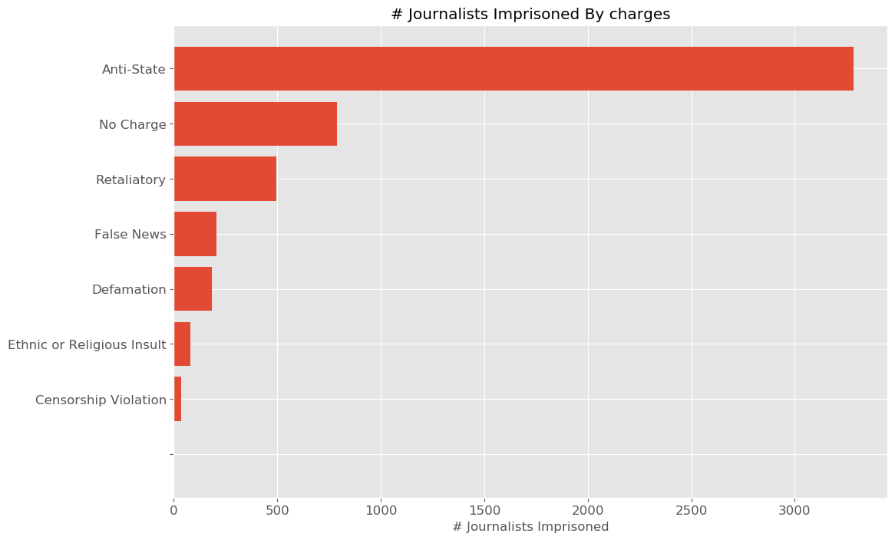
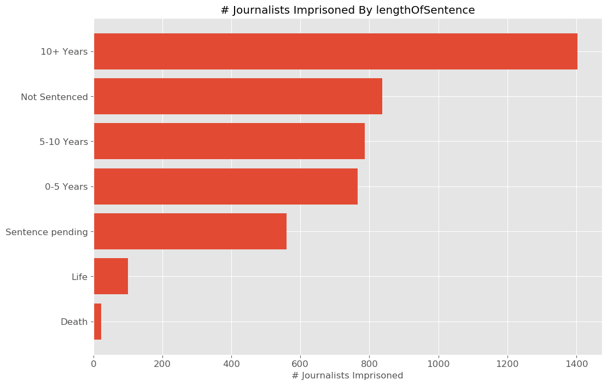

# Journalists-Under-Fire
An analysis of global threats to journalists and press freedom.

# Overview

A free press and access to timely, factual information is a vital component of any democracy. I decided to analyze global data on journalist deaths and imprisonment with the goal of identifying patterns and trends in threats to journalists and the free press. Some of the questions I had in mind when conducting the analysis included:
- Are there any trends over time? Has being a journalist become more or less dangerous?
- Spatial trends: which countries are the most dangerous for journalists?
- What types of issues are most dangerous to cover?
- What specific jobs are the most dangerous?
- What are the most common sources of attacks on journalists?

# Data 

The [Committee to Protect Journalists](https://cpj.org/) (CPJ) maintains a worldwide [database](https://cpj.org/data/) of press workers killed or imprisoned since 1992, and information/circumstances surrounding each event. I downloaded the data in csv format in early April 2020. There were two datasets:

1) Journalist Deaths since 1992
This raw data set had 2033 rows and 43 columns.
2) Journalists Imprisoned since 1992
This raw data set had 4854 rows and 43 columns. 

The majority of the features/columns in both datasets are categorical in nature. 

## Data Cleaning and Manipulation

- Drop any columns that contain all null values, or very few non-null values.
- Further narrow data by dropping columns that don't contain useful imformation for analysis.
- Use only cases w/ confirmed motive for journalist deaths; there were 1369 cases with confirmed motives.
- There were many instances, especially in the journalists imprisoned dataset, where a category value was entered in multiple different ways (different capitalization, spaces etc.) and needed to be cleaned up before analysis.
- There were several categorical columns that contained rows listing multiple categories (as a single string). I had to separate these before I could aggregate/count those features. 

After the data cleaning process:
- The journalist deaths dataset contained 1369 rows and 10 columns
- The journalists imprisoned dataset contained 4854 rows and 11 columns.

## Glimpse of final dataframes used for analysis:

### Journalist deaths 
|    |   year | fullName                  | gender   | typeOfDeath          | jobs              | coverage                  | mediums        | country     | localOrForeign   | sourcesOfFire        |
|---:|-------:|:--------------------------|:---------|:---------------------|:------------------|:--------------------------|:---------------|:------------|:-----------------|:---------------------|
|  4 |   2018 | Abadullah Hananzai        | Male     | Murder               | Producer          | Crime,Politics,War        | Radio,Internet | Afghanistan | Local            | Political Group      |
|  5 |   1998 | Abay Hailu                | Male     | Dangerous Assignment | Print Reporter    | Human Rights,Politics     | Print          | Ethiopia    | Local            | Government Officials |
|  6 |   2012 | Abd al-Karim al-Ezzo      | Male     | Crossfire            | Camera Operator   | War                       | Internet       | Syria       | Local            | Military Officials   |
|  7 |   1996 | Abdallah Bouhachek        | Male     | Murder               | Editor            | Politics                  | Print          | Algeria     | Local            | nan                  |
|  8 |   2013 | Abdel Aziz Mahmoud Hasoun | Male     | Crossfire            | Internet Reporter | Human Rights,Politics,War | Internet       | Syria       | Local            | Military Officials   |

### Journalists imprisoned 
|    |   year | fullName           | gender   | employedAs   | jobs           | coverage                  | mediums   | country   | localOrForeign   | charges    | lengthOfSentence
|---:|-------:|:-------------------|:---------|:-------------|:---------------|:--------------------------|:----------|:----------|:-----------------|:-----------|:-------------------|
|  0 |   2018 | Aasif Sultan       | Male     | Staff        | Print Reporter | Human Rights,Politics,War | Print     | India     | Local            | Anti-State | Sentence pending   |
|  1 |   2019 | Aasif Sultan       | Male     | Staff        | Print Reporter | Human Rights,Politics,War | Print     | India     | Local            | Anti-State | Sentence pending   |
|  2 |   1997 | Abay Hailu         | Male     | Staff        | Print Reporter | Human Rights,Politics     | Print     | Ethiopia  | Local            | nan        | 0-5 Years          |
|  3 |   1993 | Abbas Abdi         | Male     | nan          | Editor         | nan                       | Print     | Iran      | Local            | nan        | 0-5 Years          |
|  4 |   2011 | Abd al-Karim Thail | Male     | Staff        | Editor         | Politics                  | Internet  | Yemen     | Local            | No Charge  | Not Sentenced      |

# Analysis/Results

## Journalist Deaths 

### Patterns over time
- There doesn't appear to be a consistent trend in the number of journalists killed over time. 
- We see a spike in the early 1990's which appears to be largely related to the [Algerian Civil War](https://en.wikipedia.org/wiki/Algerian_Civil_War
- There is another general increase in journalist deaths from ~2003-2018.

### Distribution by country
Looking at the distribution by country, the top 2 are Iraq and Syria, where there have been prolonged wars. 

### Maps of journalist deaths per country
The following animation shows maps of journalist deaths per country for each year, and allows us to see how the geographical pattern changes over time. Note the color scale is the same for each year to allow comparison, and the year shown is indicated in the legend below the colorbar. 

### Distribution by type of coverage
- The most dangerous topics to cover are politics, war, human rights, and corruption.
- Sports??

### Sources of Fire

### Type of Death

## Journalists Imprisoned

### Number of journalists imprisoned over time
- In contrast to journalist deaths, there seems to be a more consistent general upward trend in the number of journalists imprisoned over time. 
- Note the increase around 1995, similar to what we saw in the number of journalist deaths. Was this largely due to Ageria also?

### Distribution by country
- The distribution by country is very different from that for journalist deaths. 
- China and Turkey are significantly worse, followed by Eritrea and Iran.

### Maps of total journlists imprisoned per country for each year
The following animation shows maps of journalist imprisonments per country for each year, and allows us to see how the geographical pattern changes over time. Note the color scale is the same for each year to allow comparison, and the year shown is indicated in the legend below the colorbar.

### Distribution by type of Coverage

### Distribution of charges
- The most common charge is by far 'Anti-State'

### Length of Sentences

# Summary
- A large number of journalists are in danger of being killed or imprisoned.
- Trends in journalist deaths tend to reflect the occurences of armed conflicts/wars, and involve journalists covering those conflicts.
- In contrast, trends in journalist imprisonments appear to be largely related to political coverage and anti-state charges.

