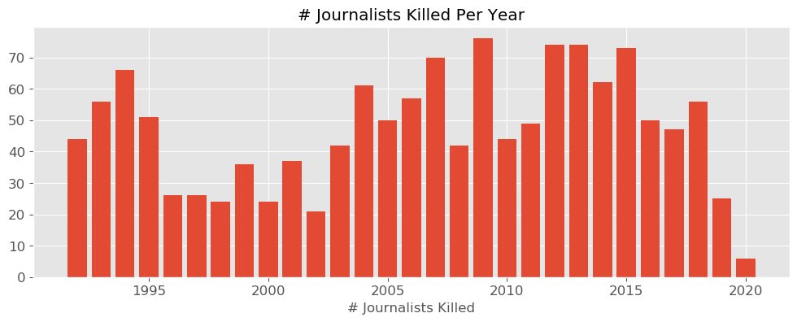
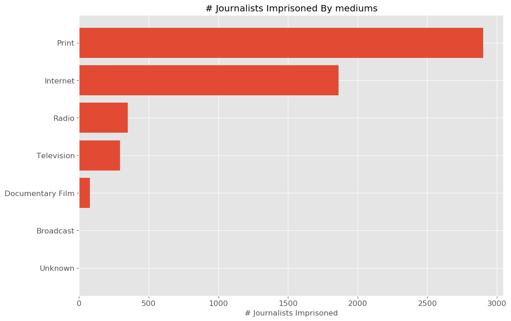

# Journalists-Under-Fire
An analysis of threats to journalists and press freedom.

**IN PROGRESS**

# Overview

A free press is a vital component of democracy. 

Some of the questions I had in mind when conducting the analysis included:
- Are there any trends over time? Has being a journalist become more or less dangerous?
- Spatial trends; which countries are the most dangerous for journalists?
- What types of issues are most dangerous to cover?
- What specific jobs are the most dangerous?
- What are the most common sources of attacks on journalists?

# Data 

## Sources
The [Committee to Protect Journalists](https://cpj.org/) (CPJ) maintains a worldwide [database](https://cpj.org/data/) of press workers killed or imprisoned since 1992, and information/circumstances surrounding each event.

## Description of Raw Data

### Journalist Deaths since 1992
This raw data set had 2033 rows and 43 columns. The majority of the columns are categorical in nature. 

### Journalists Imprisoned since 1992
This raw data set has 4854 rows and 43 columns. The majority of the columns are categorical in nature. 

## Data Cleaning and Manipulation

- Drop any columns that contain all null values, or very few non-null values.
- Further narrow data by dropping columns that don't contain useful imformation for analysis.
- Use only cases w/ confirmed motive for journalist deaths; there were 1369 confirmed cases.
- There were many instances, especially in the journalists imprisoned dataset, where a category value was entered in multiple different ways (capitalization, spaces etc.) and needed to be cleaned up before analysis.
- There were several categorical columns that contained rows listing multiple categories (as a single string). I had to separate these before I could aggregate/count. 

### Glimpse of final journalist deaths dataframe
|    |   year | fullName                  | gender   | typeOfDeath          | jobs              | coverage                  | mediums        | country     | localOrForeign   | sourcesOfFire        |
|---:|-------:|:--------------------------|:---------|:---------------------|:------------------|:--------------------------|:---------------|:------------|:-----------------|:---------------------|
|  4 |   2018 | Abadullah Hananzai        | Male     | Murder               | Producer          | Crime,Politics,War        | Radio,Internet | Afghanistan | Local            | Political Group      |
|  5 |   1998 | Abay Hailu                | Male     | Dangerous Assignment | Print Reporter    | Human Rights,Politics     | Print          | Ethiopia    | Local            | Government Officials |
|  6 |   2012 | Abd al-Karim al-Ezzo      | Male     | Crossfire            | Camera Operator   | War                       | Internet       | Syria       | Local            | Military Officials   |
|  7 |   1996 | Abdallah Bouhachek        | Male     | Murder               | Editor            | Politics                  | Print          | Algeria     | Local            | nan                  |
|  8 |   2013 | Abdel Aziz Mahmoud Hasoun | Male     | Crossfire            | Internet Reporter | Human Rights,Politics,War | Internet       | Syria       | Local            | Military Officials   |

### Glimpse of final journalist imprisoned dataframe
|    |   year | fullName           | gender   | employedAs   | jobs           | coverage                  | mediums   | country   | localOrForeign   | charges    | lengthOfSentence
|---:|-------:|:-------------------|:---------|:-------------|:---------------|:--------------------------|:----------|:----------|:-----------------|:-----------|:-------------------|
|  0 |   2018 | Aasif Sultan       | Male     | Staff        | Print Reporter | Human Rights,Politics,War | Print     | India     | Local            | Anti-State | Sentence pending   |
|  1 |   2019 | Aasif Sultan       | Male     | Staff        | Print Reporter | Human Rights,Politics,War | Print     | India     | Local            | Anti-State | Sentence pending   |
|  2 |   1997 | Abay Hailu         | Male     | Staff        | Print Reporter | Human Rights,Politics     | Print     | Ethiopia  | Local            | nan        | 0-5 Years          |
|  3 |   1993 | Abbas Abdi         | Male     | nan          | Editor         | nan                       | Print     | Iran      | Local            | nan        | 0-5 Years          |
|  4 |   2011 | Abd al-Karim Thail | Male     | Staff        | Editor         | Politics                  | Internet  | Yemen     | Local            | No Charge  | Not Sentenced      |

# Analysis/Results

## There doesn't appear to be a consistent trend in the number of journalists killed over time. We see a spike in the early 1990's (why?), and then another general increase from ~2003-2018.

## Looking at the distribution by country, the top 2 are Iraq and Syria, where there have been recent wars. 

## Map of total number of deaths by country, 1992-present.

## Animation showing total journlist deaths per country for each year

## Looking at the distribution by type of coverage, the most dangerous topics to cover are politics, war, human rights, and corruption.

## There does seem to be an general upward trend in the number of journalists imprisoned over time. Note the increase around 1995, similar to what we saw in the number of journalist deaths.

## The distribution by country is very different from that for journalist deaths. China and Turkey are significantly worse, followed by Eritrea and Iran.

## Map of total imprisoned by country since 1992

## Animation showing total journlists imprisoned per country for each year

## 

## The most common charge is by far 'Anti-State'

# Summary
- A large number of journalists are in danger of being killed or imprisoned.
- Journalist deaths are largely related to wars.
- In contrast, journalist imprisonment appears to be largely related to political coverage and anti-state charges.
- 

# Code / Reproducing Analysis

/src folder contains all scripts needed to reproduce analysis and generate figures.

- Option in script to download new updated data?

- List of packages/versions?

